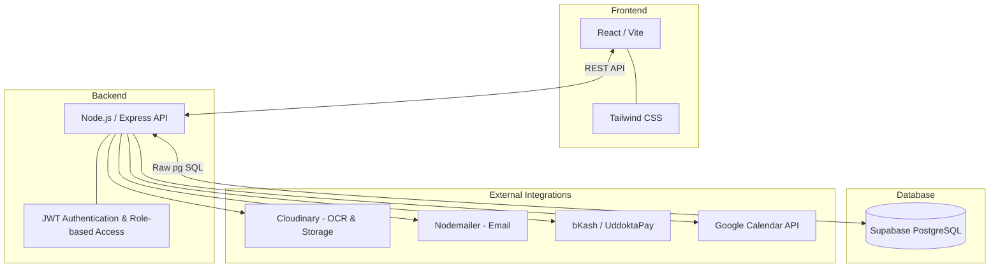

# Clarity - Supply Chain Finance & B2B Invoice Discounting

Clarity is a comprehensive B2B marketplace designed to solve a critical problem for SMEs: waiting 90 to 120 days for invoice payments. By bridging the gap between suppliers and capital providers, Clarity unlocks liquidity through verified receivable financing.

## 🌟 Key Capabilities

### For Suppliers
- **Seamless Onboarding & Invoice Origination:** Upload invoice PDFs with intelligent OCR data extraction.
- **Transparent Workflows:** Track invoices through a secure state machine (Submitted -> Buyer Confirmed -> Funded -> Payout).
- **Cash Flow Forecasting:** Predictive 30/60/90-day cash flow modeling based on confirmed invoices and expenses.
- **Real-Time Discount Rates:** Preview exact payouts prior to accepting funding using dynamic risk-based pricing.

### For Buyers
- **Digital Payables Management:** Review, approve, or dispute supplier invoices digitally.
- **Dynamic Discounting:** Utilize surplus cash to self-fund early payments directly to suppliers at negotiated discounts.
- **Supplier Health Monitoring:** Analyze supplier stability with integrated distress-signal analytics.

### For Funders
- **Exclusive Marketplace:** Access a premium pool of buyer-verified invoices.
- **First-Come-First-Funded Security:** Row-level database locking ensures invoices can never be double-funded.
- **Automated Investment Strategies:** Configure rules for hands-off portfolio growth.
- **Risk Analytics:** Leverage buyer credit scoring, maturity schedules, and adverse-scenario stress testing.

## 🏗️ System Architecture

Clarity's architecture is designed for security, concurrent transaction handling, and scalability.

### Technical Highlights
- **No-ORM Philosophy:** Leverages raw `pg` SQL for highly optimized queries and absolute control over database operations.
- **Robust Concurrency Control:** Employs `SELECT ... FOR UPDATE` row-level locks, guaranteeing race-condition prevention in the fast-paced invoice marketplace.
- **Guarded State Transitions:** Strict status pipelines enforce business logic for all events.
- **Role-Based Access Control (RBAC):** Distinct privileges for Suppliers, Buyers, Funders, and Admins.

## 🚀 Technologies Used
- **Frontend:** React, Tailwind CSS, Vite
- **Backend:** Node.js, Express.js
- **Database:** Supabase (PostgreSQL)
- **Security:** JWT, bcrypt
